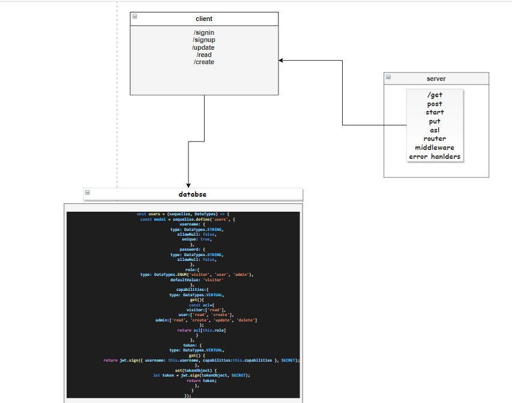

# auth-api

## uml :

* [GitHub Repo Link](https://github.com/MAMOUN-kamal-alshisani/auth-api)

* [Pull Request](https://github.com/MAMOUN-kamal-alshisani/bearer-auth/pull/1)

* [Heroku Link](https://bearerauth1.herokuapp.com/) 

##### Setup
.envre quirements
  * PORT - Port Number

**Running the app**
* `npm start`
* Endpoints:
* ##### 1 -  `/status`

***Returns Object***

   username: {
            type: DataTypes.STRING,
            allowNull: false,
            unique: true,
        },
        password: {
            type: DataTypes.STRING,
            allowNull: false,
        },
        role:{
            type: DataTypes.ENUM('visitor', 'user', 'admin'),
            defaultValue: 'visitor'
        },

**Tests**
***Unit Tests: npm run test***
